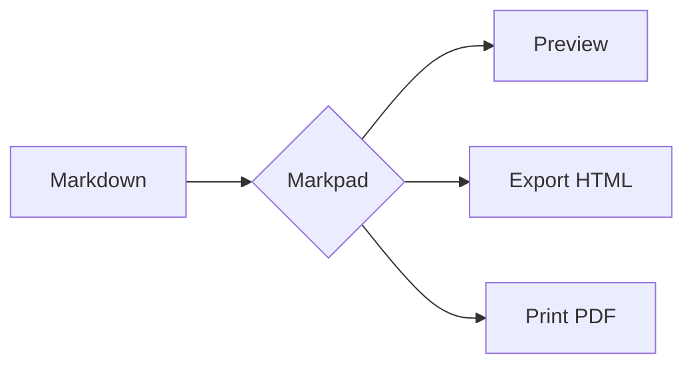
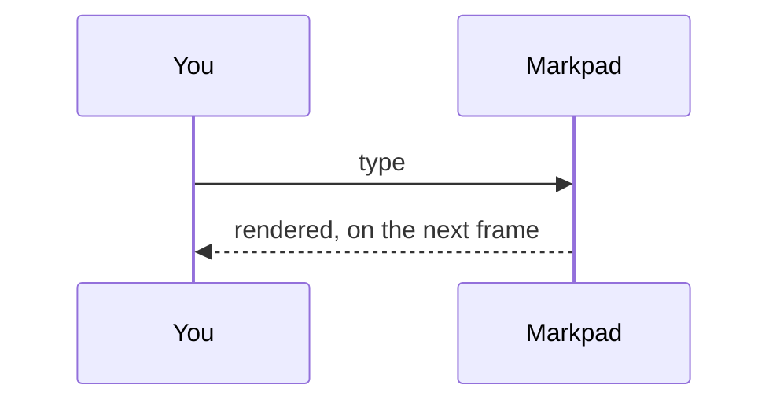
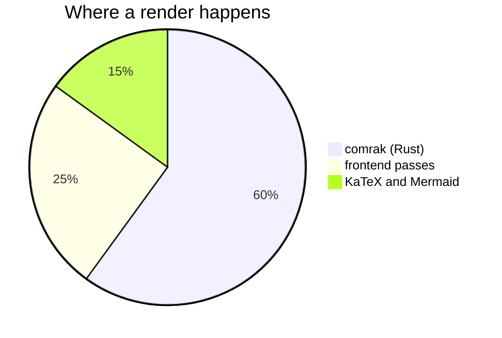
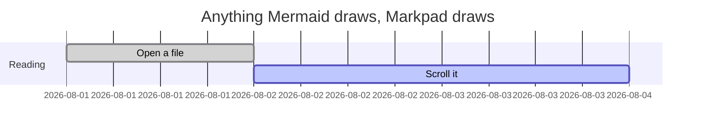

# Markdown in Markpad

**Open this file in Markpad, and read it twice.**

- In **preview**, it shows you what Markpad can do — every feature below is the real thing rather than a description of one.
- In **the editor** (`Ctrl`/`Cmd` + `E`, or split view), the same page shows you how each one is written.

That is the whole design of this file: the answer to "can it do X?" and the answer to "how do I write X?" are the same paragraph, seen from two sides.

**There is a third use for it: give the file to an AI.** Attach it to a chat and the assistant knows exactly what Markpad can render. Ask it to reformat a document you already have, or to write a new one that uses the whole range — callouts, task lists, tables, footnotes, maths, Mermaid diagrams. Save the reply as a `.md`, open it here, and it looks the way it was meant to.

If you are reading it on GitHub instead, that is useful too — the difference between what you see there and what you see in Markpad is exactly what the compatibility column below is about.

---

## What is supported, and what travels

Markdown has a small core that every reader agrees on and a large fringe that nobody standardised. Markpad's rule for the fringe:

> **Accept a spelling only where it cannot misread ordinary text — and never emit one the reader did not ask for.**

| Syntax | Markpad | On GitHub | Also used by |
|---|---|---|---|
| `**bold**` `*italic*` `` `code` `` | ✅ | ✅ | CommonMark — everyone |
| `# Heading`, lists, `> quotes`, `---` | ✅ | ✅ | CommonMark — everyone |
| `~~strikethrough~~` | ✅ | ✅ | GFM |
| `- [x]` task lists | ✅ | ✅ | GFM |
| Pipe tables | ✅ | ✅ | GFM |
| Bare URLs (`https://…`) | ✅ | ✅ | GFM |
| `[^1]` footnotes | ✅ | ✅ | GFM |
| `> [!NOTE]` alerts | ✅ | ✅ | GitHub, Obsidian |
| `$x$` and `$$x$$` math | ✅ | ✅ | GitHub, Pandoc, Obsidian, Quarto |
| ` ```mermaid ` diagrams | ✅ | ✅ | GitHub, GitLab |
| YAML front matter | ✅ shown as a panel | ⚠️ shown as a table | Jekyll, Hugo, Obsidian, Quarto |
| A single newline | ⚠️ **is a line break** | ⚠️ is a space | Obsidian, Typora, most note apps |
| `==highlight==` | ✅ | ❌ literal text | Obsidian, Pandoc, Discourse |
| `^[an inline footnote]` | ✅ | ❌ literal text | Pandoc, Obsidian |
| `++inserted++` | ✅ | ❌ literal text | Pandoc, CriticMarkup |
| Definition lists | ✅ | ❌ literal text | Pandoc, PHP Markdown Extra |
| `[[Note#Heading]]` wikilinks | ✅ | ❌ literal text | Obsidian, Logseq, Foam, Roam |
| `![[image.png]]` embeds | ✅ | ❌ literal text | Obsidian, Logseq |
| `^block-id` | ✅ | ❌ literal text | Obsidian |
| A YouTube link on its own | ✅ becomes a thumbnail | ⚠️ stays a link | — |
| `` | ✅ becomes a player | ❌ broken image | — |
| `` | ✅ becomes a player | ❌ broken image | — |
| A link to another `.md` | ✅ opens it in a tab | ✅ navigates | — |
| `~subscript~` | ❌ — it is strikethrough | ❌ — it is strikethrough | Pandoc, Typora *(opt-in)* |
| `^superscript^` | ❌ literal text | ❌ literal text | Pandoc, Typora *(opt-in)* |
| `\|\|spoiler\|\|` | ❌ literal text | ❌ literal text | Discord, Obsidian |
| `:emoji:` shortcodes | ❌ literal text | ✅ | GitHub |

The three ❌ at the bottom are **deliberate**, and the reasons are worth knowing because they are the same reason:

- **`~x~`** — GFM defines strikethrough as *one or two* tildes. `~x~` is struck-through text on GitHub, and here. Reading it as a subscript would take a spelling GitHub already uses, and `H~2~O` would then look different in the two places. Write `H<sub>2</sub>O`, which works in both.
- **`^x^`** — two carets in one paragraph pair up, so `a^2 + b^2 = c^2` — ordinary prose that renders correctly today — would become `a<sup>2 + b</sup>2 = c^2`.
- **`||x||`** — that is also how an empty table cell is written. `| 1 || 3 |` would collapse into one cell reading `1 || 3`.

And one difference that is not a syntax at all, but changes how every paragraph looks:

- **A single newline is a line break here.** In CommonMark — and on GitHub — a line break inside a paragraph is just a space, and the text reflows. Markpad breaks where you broke, which is what a note-taking app is usually expected to do, and what Obsidian and Typora do. A paragraph you wrap by hand will therefore look different on GitHub. Leave a blank line between paragraphs and the two agree.

---

## 1. Text

**Bold**, *italic*, ***both***, ~~struck through~~, `inline code`, <u>underlined</u> (HTML, since Markdown has no syntax for it), and ==highlighted==.

An escaped \*asterisk\* stays an asterisk. So does a \\backslash.

Emphasis does not fire inside a word, so `snake_case_names` and 2*3*4 survive: snake_case_names and 2*3*4.

Line breaks are literal: this line
and this one are two lines, not one paragraph reflowed. Two trailing spaces or a trailing backslash — the CommonMark spellings — work as well, and are what to use if the document also has to render on GitHub.\
This line followed a backslash.

### Escaping

Anything above can be escaped with a backslash, which is how this document shows syntax without triggering it: \*not italic\*, \==not highlighted\==, \[\[not a wikilink\]\].

Inside `` `code spans` `` nothing is interpreted at all — `**bold**`, `[[Notes]]`, `$x$` and `==mark==` are all literal there. That is the usual way to write about Markdown in Markdown.

HTML entities work: &copy; &mdash; &hellip; &#8594; &amp;

## 2. Headings

Every heading gets an anchor. Hover one in the preview and a link icon appears; right-click it for **Copy Reference**, which writes a link in whichever style this document already uses.

### A third-level heading

#### A fourth

##### A fifth

###### A sixth

A first- and second-level heading can also be underlined instead, which is the other CommonMark spelling:

An underlined H1
================

An underlined H2
----------------

## 3. Lists

- A bullet
- Another
  - Nested
    - Deeper
- Back to the top level

1. First
2. Second
   1. Nested and numbered
3. Third

A list can start anywhere, and `)` works as well as `.`:

7) Seven
8) Eight
9) Nine

Items separated by blank lines get paragraph spacing — "loose" rather than "tight":

- A loose item, with room around it.

- Another one.

A list item can hold anything:

1. A step with its own code block:

   ```bash
   npm run tauri dev
   ```

2. And its own quote:

   > Including this.

- [x] A finished task — click the box in the preview and the file is edited
- [ ] An unfinished one
  - [ ] Nested, and also clickable

**The editor writes the markers.** Press `Enter` inside an item and the next line carries the same one: a bullet keeps the character it was written with, a numbered item increments, a task item arrives unticked. `Tab` and `Shift`+`Tab` change the level. `Enter` on an item with nothing in it clears the marker and leaves the list, which is how you get out.

A list can also be started from the keyboard: `Ctrl`/`Cmd` + `Shift` + `8` for bullets, `7` for numbers, `9` for a task list.

## 4. Quotes and alerts

> An ordinary blockquote.
>
> With a second paragraph.

> Quotes nest:
>
> > and the inner one is indented again,
> >
> > > three deep.

> A quote can contain anything else:
>
> - a list
> - with items
>
> ```js
> // and a code block
> ```

> [!NOTE]
> Alerts are GitHub's, and Markpad renders the same five.

> [!TIP]
> Useful advice.

> [!IMPORTANT]
> Something you should not miss.

> [!WARNING]
> Something that could go wrong.

> [!CAUTION]
> Something that could go badly wrong.

Markpad adds five more that GitHub does not have — `[!INFO]`, `[!TODO]`, `[!FAQ]`, `[!QUESTION]`, `[!EXAMPLE]` — and a foldable form, `[!NOTE]+` for open and `[!NOTE]-` for closed:

> [!TODO]
> One of the five extra kinds.

> [!EXAMPLE]-
> Folded to begin with. Click the title to open it.

## 5. Code

Inline `const answer = 42`, and fenced blocks with a language:

```javascript
const features = ['tables', 'math', 'diagrams'];
console.log(`Markpad renders ${features.length} of these`);
```

```python
from pathlib import Path

def headings(document: Path) -> list[str]:
    return [line for line in document.read_text().splitlines() if line.startswith("#")]
```

```rust
fn main() {
    println!("Syntax highlighting comes from highlight.js");
}
```

A block with no language is left unhighlighted, which is usually what you want for output:

```
$ markpad --help
Usage: markpad [FILE]
```

Fences can be written with tildes instead, which is handy when the block itself contains backticks:

~~~markdown
```js
const nested = true;
```
~~~

Four spaces of indentation is the older spelling, and still works:

    an indented code block
    with two lines

## 6. Tables

| Feature | Renders | Notes |
|---|:---:|---|
| Alignment | ✅ | `:---`, `:---:`, `---:` |
| Long cells | ✅ | wrap rather than clip |
| Inline markup | ✅ | **bold**, `code`, [links](#6-tables) |

| Left | Centre | Right |
|:---|:---:|---:|
| a | b | 1 |
| cc | dd | 22 |
| eee | fff | 333 |

A literal pipe inside a cell is escaped:

| Expression | Means |
|---|---|
| `a \| b` | a or b |
| `x \|\| y` | x if it is set, else y |

An empty cell is written with two pipes — `| 1 || 3 |` — which is why the spoiler syntax is not supported:

| One | Two | Three |
|---|---|---|
| 1 || 3 |

**None of that has to be typed by hand.** With the caret in a table:

| Key | Does |
|---|---|
| `Tab` / `Shift`+`Tab` | move to the next / previous cell — `Tab` in the last one appends a row |
| `Ctrl`/`Cmd` + `Enter` | insert a row below, `Shift` for above |
| `Ctrl`/`Cmd` + `Shift` + `C` | insert a column |
| `Ctrl`/`Cmd` + `Shift` + `Backspace` | delete the column |
| `Ctrl`/`Cmd` + `Alt`/`Option` + `T` | insert a table to begin with |

Every edit reformats the table, so the pipes stay lined up — including in CJK text, where a character is two columns wide. To delete a row, delete its line. The rest of the table commands are in the command palette (`F1`).

## 7. Thematic breaks

Three or more of `-`, `*` or `_` on their own line, all the same rule:

---

***

___

## 8. Links

An [ordinary link](https://commonmark.org), one [with a title](https://commonmark.org "The CommonMark site"), a bare URL https://spec.commonmark.org, and one in parentheses (https://github.github.com/gfm/) — the closing bracket is not swallowed.

Angle brackets make a link out of anything: <https://commonmark.org> and <someone@example.com>.

Reference-style links keep the URL out of the sentence, which is easier to read in the source:

The [CommonMark spec][spec] and the [GFM spec][gfm] disagree in about twenty places.

[spec]: https://spec.commonmark.org "CommonMark"
[gfm]: https://github.github.com/gfm/ "GitHub Flavored Markdown"

A link to a heading in this document: [back to the table](#what-is-supported-and-what-travels). Type `](#` in the editor and Markpad completes the headings for you.

`Ctrl`/`Cmd` + `K` inserts a link around whatever is selected.

### Wikilinks

Markpad understands Obsidian's spelling and rewrites it before rendering:

- `[[stress-test#6. Tables]]` → [[stress-test#6. Tables]]
- `[[stress-test#6. Tables|with an alias]]` → [[stress-test#6. Tables|with an alias]]
- `[[#1. Text]]` for a heading in this document → [[#1. Text]]

Type `[[#` and the headings complete here too. A wikilink **without** a heading is deliberately left as literal text: `[[Notes]]` is also how citation numbering and CommonMark reference links are written.

### Block ids

A paragraph can be given an id and linked to. ^demo-block

That paragraph ends with `^demo-block`, and [[#^demo-block]] points at it.

## 9. Images and embeds

A local image, resolved relative to this file:


With a title, which most readers show on hover:


A reference-style image, where the destination lives elsewhere in the document:

![Drag and drop][dnd]

[dnd]: ../pics/drag-and-drop.png "Dropping a file onto the editor"

Obsidian's embed syntax works for local files too — `![[lightmode.png]]` — resolved the same way. Dragging an image into the editor writes the reference for you; dragging a `.md` file onto either pane opens it in a tab.

### Video and audio

An image reference whose file is a video or a sound becomes a player, with controls. Nothing new to learn — it is the `` you already know, pointing at a different kind of file:

```markdown


```

Video: `mp4`, `webm`, `ogg`, `mov`. Audio: `mp3`, `wav`, `aac`, `flac`, `m4a`. A `width` or `height` written in HTML carries over to the player.

### YouTube

A YouTube link **alone in its paragraph** becomes a thumbnail that opens in your browser:

https://www.youtube.com/watch?v=dQw4w9WgXcQ

The image form does the same thing:

```markdown

```

A YouTube link in the middle of a sentence — like https://youtu.be/dQw4w9WgXcQ here — stays an ordinary link, because replacing it would break the sentence around it.

### Links to other documents

A link to another Markdown file opens it in a **new tab** rather than leaving the app: [the stress test](stress-test.md), and [a heading inside it](stress-test.md#7-code). Back and forward work as they do in a browser.

**The path is not limited to this folder.** It is resolved against the document you are reading, the way a relative path works anywhere else:

| Written | Resolves to (from `/notes/project/index.md`) |
|---|---|
| `[x](other.md)` | `/notes/project/other.md` — a sibling |
| `[x](sub/deep.md)` | `/notes/project/sub/deep.md` — into a folder |
| `[x](../sibling.md)` | `/notes/sibling.md` — up one |
| `[x](../../up.md)` | `/up.md` — and up again |
| `[x](/abs/root.md)` | `/abs/root.md` — an absolute path |
| `[x](C:/win/abs.md)` | `C:/win/abs.md` — Windows, with a drive letter |
| `[x](with%20space.md)` | `/notes/project/with space.md` — percent-encoding is decoded |
| `[x](other.md#a-heading)` | that file, scrolled to that heading |

Which files are claimed: `.md`, `.markdown`, `.mdown`, `.mkd`, `.txt`. Anything else — a `.pdf`, an image, a folder — is handed to your system to open with whatever it normally uses.

Two things are deliberately **not** claimed, even when they end in `.md`:

- **Anything with a scheme.** `https://example.com/notes.md` is a web address and opens in your browser, not as a tab.
- **A protocol-relative URL.** `//example.com/notes.md` looks like a path and is one of these: it is an address on another host.

If the file does not exist, the tab you are in stays exactly as it was and the error is reported — the document you were reading is not closed or replaced.

The wikilink spelling resolves the same way, and appends `.md` for you: `[[sub/deep#Setup]]` reaches `sub/deep.md`.

## 10. Footnotes

The usual kind[^ref], and Pandoc's inline kind^[which is written where it is read, with no label to invent]. A footnote can be referenced more than once[^ref], and both references point at the same note.

[^ref]: The definition can live anywhere in the document — Markpad collects them at the bottom, numbered in the order they are referenced.

    A footnote can also run to several paragraphs, as long as the continuation is indented.

## 11. Maths

Inline: $e^{i\pi} + 1 = 0$, and $\sum_{i=1}^{n} i = \frac{n(n+1)}{2}$. A price like \$5 needs escaping, or the next `$` would close a formula around it.

Display:

$$
\int_{-\infty}^{\infty} e^{-x^2}\,dx = \sqrt{\pi}
$$

$$
A = \begin{bmatrix} 1 & 2 \\ 3 & 4 \end{bmatrix}
$$

Multi-line environments keep their rows:

$$
\begin{aligned}
  f(x) &= (x + 1)^2 \\
       &= x^2 + 2x + 1
\end{aligned}
$$

Rendered by KaTeX. An escaped `\$5` stays a dollar sign rather than opening a formula.

## 12. Diagrams









## 13. Definition lists

Markdown
: A plain-text format that stays readable unrendered.

Markpad
: A reader and editor for it, which is what you are using.
: A term can have more than one definition.

## 14. Inserted text

Pandoc and CriticMarkup mark added text with `++`: this sentence has ++an insertion++ in it.

## 15. Other scripts and symbols

这是一段中文，用来检查字体、行高和换行。**中文的粗体**、`行内代码` 和[链接](https://commonmark.org)都应该正常。

日本語のテキストもここで確認できます。**太字**と`コード`。

한국어 문장도 마찬가지입니다. **굵게**와 `코드`.

In the editor those three paragraphs are treated as prose rather than as code: `Alt`/`Option` + `←`/`→` and double-click stop at word boundaries *inside* a Chinese or Japanese clause instead of swallowing the whole sentence, and neither the fullwidth punctuation nor the ideographic space an IME produces is outlined as a suspicious character.

Symbols and emoji: → ← ↔ ⇒ ∑ ∏ √ ∞ ≈ ≠ ≤ ≥ ± × ÷ °  🚀 📘 ✅ ⚠️

## 16. Raw HTML

<details>
<summary>A collapsible section</summary>

Markdown inside an HTML block still renders — **bold**, `code`, and a [link](https://commonmark.org).

</details>

<kbd>Ctrl</kbd> + <kbd>S</kbd> saves. <mark>Marked text</mark> and <sub>subscript</sub> / <sup>superscript</sup> are available as HTML, which is the spelling that works everywhere.

---

## 17. Things this page does that are not syntax

Some of what Markpad adds is not a spelling to learn but behaviour you get for free. They are easiest to try right here:

- **Click a task box** in the preview and the file is edited. The `[ ]` becomes `[x]` on disk, on the right line, even in a nested list.
- **Hover a heading** and an anchor appears. Right-click it for **Copy Reference**, which writes a link in whichever style this document already uses — `[[…]]` if the document uses wikilinks, `[…](#…)` if it uses standard links.
- **Right-click any paragraph, list item or heading** and choose **Edit**: the editor opens on exactly those lines, with them selected. `Ctrl`/`Cmd` + `E` does the same for whatever you have selected in the preview.
- **Fold a heading** with the chevron beside it, and everything under it collapses. The folds are remembered per document.
- **Scroll either pane of the split view** and the other follows by source line rather than by ratio, so the two stay together even this far down the document.
- **Sticky scroll** keeps the heading you are currently inside pinned to the top of the editor. Toggle it in Settings.
- **Open the table of contents** and it follows wherever you scroll, in the preview or in the editor, keeping the current heading centred. Unpinned, it gets out of the way rather than sitting on the text: it collapses when you pick an entry, and when you reach past it to touch what it was covering.
- **Type `](#` or `[[#`** in the editor and every heading in the document is offered as a completion.
- **The front matter** at the top of this file — the `title` and `description` between `---` lines — is shown as a panel rather than as text, and is editable there.
- **Export** this page to HTML, or print it to PDF, and the maths and diagrams come with it.

---

## Where each of these is rendered

Not a user-facing detail, but useful if something looks wrong and you are deciding where to report it:

| Stage | Does |
|---|---|
| Rust (comrak) | CommonMark, GFM, footnotes, highlight, insert, definition lists, and the wikilink / embed / block-id rewrites |
| Frontend | Alerts, front matter panel, heading folds and anchors, media players, YouTube thumbnails, local link resolution |
| Frontend, async | KaTeX for maths, Mermaid for diagrams, highlight.js for code |

Raw HTML is allowed and sanitised — `<style>` is the one tag that is dropped, since a document should not be able to restyle the app around it.

Everything above is exercised by the test suite. If a row in the compatibility table is wrong, that is a bug worth [reporting](https://github.com/sftwrdotdev/Markpad/issues).
