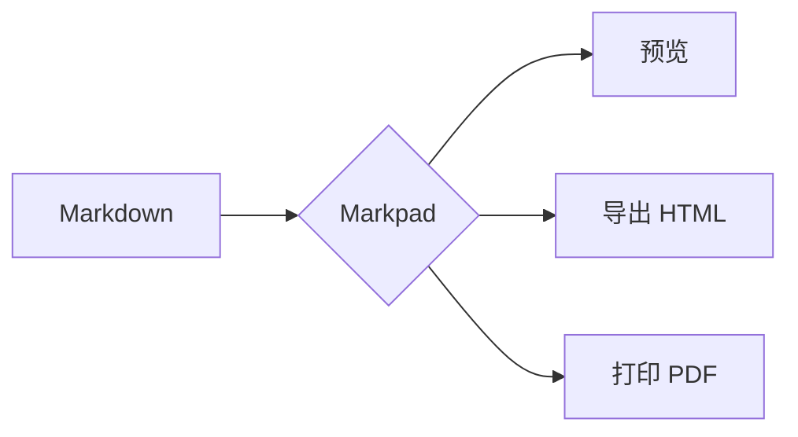
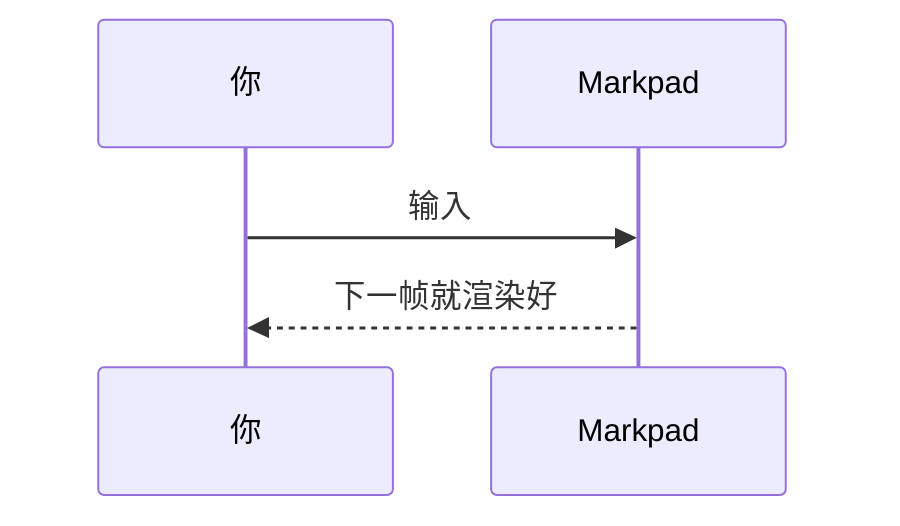
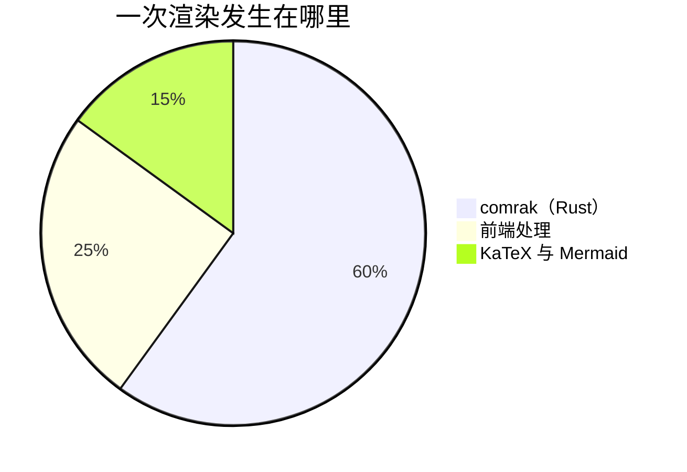

# Markpad 里的 Markdown

**用 Markpad 打开这个文件，读两遍。**

- 在**预览**里，它展示 Markpad 能做什么——下面每一项都是真的渲染出来的，不是对它的描述。
- 在**编辑器**里（`Ctrl`/`Cmd` + `E`，或者开分屏），同一页展示每一项是怎么写的。

这就是这份文件的全部设计：「它能不能做 X」和「X 怎么写」的答案，是同一段文字的两面。

**它还有第三种用法：把这个文件交给 AI。** 附进对话，AI 就完整知道 Markpad 能渲染什么。可以请它帮你把手上的文档重新排版，也可以让它直接用满这一整套写一份新的——提示框、任务列表、表格、脚注、公式、Mermaid 图。把回复存成 `.md` 用 Markpad 打开，就是它本来该有的样子。

如果你是在 GitHub 上读到这里，也有用——你在那边看到的和在 Markpad 里看到的差别，正是下面兼容性那一列在讲的事。

---

## 支持什么，以及走得出去多远

Markdown 有一个所有阅读器都认的小内核，和一大圈没人标准化的外延。Markpad 对外延的判据是：

> **只在一种写法不会误读普通文字时才接受它——而且绝不主动产出用户没要求的写法。**

| 语法 | Markpad | 在 GitHub 上 | 还有谁在用 |
|---|---|---|---|
| `**粗体**` `*斜体*` `` `代码` `` | ✅ | ✅ | CommonMark —— 所有人 |
| `# 标题`、列表、`> 引用`、`---` | ✅ | ✅ | CommonMark —— 所有人 |
| `~~删除线~~` | ✅ | ✅ | GFM |
| `- [x]` 任务列表 | ✅ | ✅ | GFM |
| 管道表格 | ✅ | ✅ | GFM |
| 裸 URL（`https://…`） | ✅ | ✅ | GFM |
| `[^1]` 脚注 | ✅ | ✅ | GFM |
| `> [!NOTE]` 提示框 | ✅ | ✅ | GitHub、Obsidian |
| `$x$` 和 `$$x$$` 公式 | ✅ | ✅ | GitHub、Pandoc、Obsidian、Quarto |
| ` ```mermaid ` 图表 | ✅ | ✅ | GitHub、GitLab |
| YAML front matter | ✅ 显示成面板 | ⚠️ 显示成表格 | Jekyll、Hugo、Obsidian、Quarto |
| 段落里的单个换行 | ⚠️ **就是换行** | ⚠️ 变成空格 | Obsidian、Typora，多数笔记应用 |
| `==高亮==` | ✅ | ❌ 字面文本 | Obsidian、Pandoc、Discourse |
| `^[行内脚注]` | ✅ | ❌ 字面文本 | Pandoc、Obsidian |
| `++插入++` | ✅ | ❌ 字面文本 | Pandoc、CriticMarkup |
| 定义列表 | ✅ | ❌ 字面文本 | Pandoc、PHP Markdown Extra |
| `[[笔记#标题]]` wikilink | ✅ | ❌ 字面文本 | Obsidian、Logseq、Foam、Roam |
| `![[图片.png]]` 嵌入 | ✅ | ❌ 字面文本 | Obsidian、Logseq |
| `^块ID` | ✅ | ❌ 字面文本 | Obsidian |
| 独占一段的 YouTube 链接 | ✅ 变成缩略图 | ⚠️ 还是链接 | —— |
| `` | ✅ 变成播放器 | ❌ 坏掉的图片 | —— |
| `` | ✅ 变成播放器 | ❌ 坏掉的图片 | —— |
| 指向另一份 `.md` 的链接 | ✅ 在新标签页打开 | ✅ 页面跳转 | —— |
| `~下标~` | ❌ —— 那是删除线 | ❌ —— 那是删除线 | Pandoc、Typora *(需手动开启)* |
| `^上标^` | ❌ 字面文本 | ❌ 字面文本 | Pandoc、Typora *(需手动开启)* |
| `\|\|剧透\|\|` | ❌ 字面文本 | ❌ 字面文本 | Discord、Obsidian |
| `:emoji:` 短代码 | ❌ 字面文本 | ✅ | GitHub |

最下面三个 ❌ 是**刻意的**，而且理由是同一个：

- **`~x~`** —— GFM 规定删除线是*一个或两个*波浪号，所以 `~x~` 在 GitHub 上、在这里，都是删除线。把它读成下标等于抢走一个 GitHub 已经在用的写法，`H~2~O` 从此在两边显示不同。写 `H<sub>2</sub>O`，两边都对。
- **`^x^`** —— 同一段里两个 `^` 会配成一对，于是 `a^2 + b^2 = c^2` 这种今天渲染正常的普通句子，会变成 `a<sup>2 + b</sup>2 = c^2`。
- **`||x||`** —— 那也是表格里空单元格的写法。`| 1 || 3 |` 会塌成一个内容为 `1 || 3` 的格子。

还有一条差别不是语法，但影响每一个段落的观感：

- **这里的单个换行就是换行。** 在 CommonMark 和 GitHub 上，段落内部的换行只是一个空格，文字会重新排版。Markpad 你在哪断行就在哪断——这是笔记应用通常被期待的行为，Obsidian 和 Typora 也这样。所以你手工折行的段落，在 GitHub 上看起来会不一样。段落之间空一行，两边就一致了。

---

## 1. 文字

**粗体**、*斜体*、***两者***、~~删除线~~、`行内代码`、<u>下划线</u>（HTML，因为 Markdown 没有下划线语法），以及==高亮==。

转义之后的 \*星号\* 还是星号，\\反斜杠 也是。

词内部不会触发强调，所以 `snake_case_names` 和 2*3*4 都安全：snake_case_names 和 2*3*4。

换行是字面的：这一行
和这一行是两行，不会被合并重排。两个尾随空格、或者行尾一个反斜杠——CommonMark 的两种写法——同样有效，如果这份文档还要拿到 GitHub 上渲染，就该用它们。\
这一行跟在反斜杠后面。

### 转义

上面任何一种都可以用反斜杠关掉，这份文档展示语法本身靠的就是它：\*不是斜体\*、\==不是高亮\==、\[\[不是 wikilink\]\]。

`` `代码块里` `` 什么都不解释——`**粗体**`、`[[笔记]]`、`$x$`、`==高亮==` 在那里面全是字面文字。用 Markdown 写 Markdown 的常规做法就是这个。

HTML 实体也认：&copy; &mdash; &hellip; &#8594; &amp;

## 2. 标题

每个标题都会得到一个锚点。在预览里把鼠标移上去会出现链接图标；右键选 **复制引用**，它会按这份文档已经在用的风格写出链接。

### 三级标题

#### 四级

##### 五级

###### 六级

一级和二级标题还可以用下划线写，这是 CommonMark 的另一种拼法：

用下划线写的一级标题
==================

用下划线写的二级标题
------------------

## 3. 列表

- 一个项目
- 又一个
  - 嵌套
    - 更深
- 回到顶层

1. 第一
2. 第二
   1. 嵌套且编号
3. 第三

编号可以从任意数字开始，`)` 和 `.` 都行：

7) 七
8) 八
9) 九

项目之间空一行就变成"松散"列表，段落间距会拉开：

- 一个松散的项目，上下都有空间。

- 又一个。

列表项里可以放任何东西：

1. 一个带自己代码块的步骤：

   ```bash
   npm run tauri dev
   ```

2. 也可以带自己的引用：

   > 比如这个。

任务列表可以点：

- [x] 已完成——在预览里点方框，文件会被真的改写
- [ ] 未完成
  - [ ] 嵌套的也能点

**标记由编辑器替你写。** 在列表项里按 `Enter`，下一行会带上同样的标记：符号列表沿用你写的那个字符，有序列表编号递增，任务项默认未勾选。`Tab` 和 `Shift`+`Tab` 换层级：这一项会移到父项的内容列上，两边的有序列表都会重新编号——它加入的那个，和它离开的那个。在一个空的列表项上按 `Enter` 会清掉标记、离开列表——这是走出列表的方式。

列表也可以直接用键盘起头：`Ctrl`/`Cmd` + `Shift` + `8` 符号列表、`7` 有序列表、`9` 任务列表。

## 4. 引用与提示框

> 普通的引用块。
>
> 带第二段。

> 引用可以嵌套：
>
> > 内层再缩进一次，
> >
> > > 三层深。

> 引用里可以放别的东西：
>
> - 一个列表
> - 有若干项
>
> ```js
> // 还有代码块
> ```

> [!NOTE]
> 提示框是 GitHub 的写法，Markpad 支持同样的五种。

> [!TIP]
> 有用的建议。

> [!IMPORTANT]
> 不该错过的东西。

> [!WARNING]
> 可能出问题的地方。

> [!CAUTION]
> 可能出大问题的地方。

Markpad 另外多支持五种 GitHub 没有的——`[!INFO]`、`[!TODO]`、`[!FAQ]`、`[!QUESTION]`、`[!EXAMPLE]`——以及可折叠形式，`[!NOTE]+` 默认展开，`[!NOTE]-` 默认收起：

> [!TODO]
> 多出来的五种之一。

> [!EXAMPLE]-
> 一开始是折叠的。点标题展开。

**`>` 也由编辑器替你写。** 在引用里按 `Enter`，下一行会带上同样深度的 `>`，嵌套也一样。在一个空的引用行上按 `Enter` 会一次清掉——嵌了几层都只要一次——这是走出引用的方式。

## 5. 代码

行内的 `const answer = 42`，以及带语言标注的围栏代码块：

```javascript
const features = ['表格', '公式', '图表'];
console.log(`Markpad 渲染其中的 ${features.length} 种`);
```

```python
from pathlib import Path

def headings(document: Path) -> list[str]:
    return [line for line in document.read_text().splitlines() if line.startswith("#")]
```

```rust
fn main() {
    println!("语法高亮来自 highlight.js");
}
```

不标语言的块不会被高亮，展示程序输出时通常正是想要的：

```
$ markpad --help
Usage: markpad [FILE]
```

围栏也可以用波浪号写，块里本身含有反引号时很方便：

~~~markdown
```js
const nested = true;
```
~~~

四个空格缩进是更老的写法，同样有效：

    一个缩进代码块
    共两行

## 6. 表格

| 特性 | 是否渲染 | 说明 |
|---|:---:|---|
| 对齐 | ✅ | `:---`、`:---:`、`---:` |
| 长内容 | ✅ | 会换行而不是被截断 |
| 单元格内的行内标记 | ✅ | **粗体**、`代码`、[链接](#6-表格) |

| 左对齐 | 居中 | 右对齐 |
|:---|:---:|---:|
| 甲 | 乙 | 1 |
| 丙丙 | 丁丁 | 22 |
| 戊戊戊 | 己己己 | 333 |

单元格里的竖线要转义：

| 表达式 | 含义 |
|---|---|
| `a \| b` | a 或 b |
| `x \|\| y` | x 有值就取 x，否则取 y |

空单元格用两个竖线写——`| 1 || 3 |`——这正是剧透语法不被支持的原因：

| 一 | 二 | 三 |
|---|---|---|
| 1 || 3 |

**这些都不用手敲。** 光标在表格里时：

| 按键 | 作用 |
|---|---|
| `Tab` / `Shift`+`Tab` | 跳到下一个 / 上一个单元格——在最后一格按 `Tab` 会补一行 |
| `Ctrl`/`Cmd` + `Enter` | 在下方插入一行，加 `Shift` 是上方 |
| `Ctrl`/`Cmd` + `Shift` + `C` | 插入一列 |
| `Ctrl`/`Cmd` + `Shift` + `Backspace` | 删掉这一列 |
| `Ctrl`/`Cmd` + `Alt`/`Option` + `T` | 从头插入一张表 |

每次编辑都会重排整张表，竖线始终对齐——中日韩字符按两列宽算，所以中文表格也齐。要删掉一行，把那一行删掉就是。其余的表格命令在命令面板里（`F1`）。

## 7. 分隔线

`-`、`*` 或 `_` 三个以上单独成行，三种是同一条线：

---

***

___

## 8. 链接

一个[普通链接](https://commonmark.org)、一个[带标题的](https://commonmark.org "CommonMark 官网")、一个裸 URL https://spec.commonmark.org，以及一个写在括号里的 (https://github.github.com/gfm/)——右括号不会被吞掉。

尖括号能把任何东西变成链接：<https://commonmark.org> 和 <someone@example.com>。

引用式链接把 URL 挪出句子，源码读起来更清爽：

[CommonMark 规范][spec] 和 [GFM 规范][gfm] 在大约二十处上不一致。

[spec]: https://spec.commonmark.org "CommonMark"
[gfm]: https://github.github.com/gfm/ "GitHub Flavored Markdown"

指向本文档某个标题的链接：[回到那张表](#支持什么以及走得出去多远)。在编辑器里输入 `](#`，Markpad 会把标题列出来给你选。

`Ctrl`/`Cmd` + `K` 给选中的文字套上链接。

### Wikilink

Markpad 认识 Obsidian 的写法，并在渲染前把它改写成标准链接：

- `[[stress-test#6. Tables]]` → [[stress-test#6. Tables]]
- `[[stress-test#6. Tables|带别名]]` → [[stress-test#6. Tables|带别名]]
- 指向本文档标题的 `[[#1. 文字]]` → [[#1. 文字]]

输入 `[[#` 这里同样会补全标题。**不带标题**的 wikilink 是刻意保留成字面文本的：`[[笔记]]` 这个形状同时也是文献引用编号和 CommonMark 引用式链接的写法。

### 块 ID

一个段落可以被赋予 ID 并被链接到。 ^demo-block

上面那段以 `^demo-block` 结尾，而 [[#^demo-block]] 指向它。

## 9. 图片与嵌入

相对于本文件解析的本地图片：


带 title，多数阅读器会在悬停时显示：


引用式图片，地址写在文档别处：

![拖放][dnd]

[dnd]: ../pics/drag-and-drop.png "把文件拖到编辑器上"

Obsidian 的嵌入语法对本地文件同样有效——`![[lightmode.png]]`——解析方式一致。把图片拖进编辑器会自动写好引用；把 `.md` 文件拖到任一侧都会在标签页里打开它。

**粘贴或拖进来的图片落在哪里**是一个设置：一个文件夹名，建在文档旁边。里面写 `${filename}` 代表文档自己的名字（不含扩展名），所以 `notes/trip.md` 旁边写 `${filename}.assets`，图片就落进 `notes/trip.assets`，一个文件夹里的笔记不再共用同一个 `img/`。这个写法和 Typora、SoloMD 一致。它展开出来的是一个文件夹**名**而不是路径——分隔符、`..` 和绝对路径都会被拒绝——所以图片始终留在它所属的文档旁边。

### 视频与音频

指向视频或音频文件的图片引用会变成带控件的播放器。没有新语法要学——就是你已经会的 ``，只是指向了另一类文件：

```markdown


```

视频认 `mp4`、`webm`、`ogg`、`mov`；音频认 `mp3`、`wav`、`aac`、`flac`、`m4a`。用 HTML 写的 `width` 或 `height` 会带到播放器上。

### YouTube

**独占一段**的 YouTube 链接会变成缩略图，点击在浏览器里打开：

https://www.youtube.com/watch?v=dQw4w9WgXcQ

图片形式效果相同：

```markdown

```

写在句子中间的 YouTube 链接——比如这里的 https://youtu.be/dQw4w9WgXcQ ——仍然是普通链接，因为替换它会把句子打断。

### 指向其它文档的链接

指向另一份 Markdown 文件的链接会**在新标签页打开**，而不是离开应用：[压测文档](stress-test.md)，以及[它里面的某个标题](stress-test.md#7-code)。前进后退和浏览器里一样。

**路径不限于同一个文件夹。** 它相对于你正在读的这份文档解析，和相对路径在别处的行为一致：

| 写法 | 从 `/notes/project/index.md` 解析到 |
|---|---|
| `[x](other.md)` | `/notes/project/other.md` —— 同级 |
| `[x](sub/deep.md)` | `/notes/project/sub/deep.md` —— 进子目录 |
| `[x](../sibling.md)` | `/notes/sibling.md` —— 上一级 |
| `[x](../../up.md)` | `/up.md` —— 再上一级 |
| `[x](/abs/root.md)` | `/abs/root.md` —— 绝对路径 |
| `[x](C:/win/abs.md)` | `C:/win/abs.md` —— Windows 盘符路径 |
| `[x](with%20space.md)` | `/notes/project/with space.md` —— 百分号编码会被解码 |
| `[x](other.md#a-heading)` | 该文件，并滚动到那个标题 |

会被认领的扩展名：`.md`、`.markdown`、`.mdown`、`.mkd`、`.txt`。其余的——`.pdf`、图片、文件夹——交给系统用它平常的程序打开。

有两种即使以 `.md` 结尾也**刻意不认领**：

- **带协议的**。`https://example.com/notes.md` 是网址，会在浏览器里打开，不会变成标签页。
- **协议相对的 URL**。`//example.com/notes.md` 看着像路径，其实是另一台主机上的地址。

如果目标文件不存在，你当前的标签页原样不动，错误会被报出来——正在读的文档不会被关掉或替换。

wikilink 走同一套解析，并自动补上 `.md`：`[[sub/deep#Setup]]` 会到达 `sub/deep.md`。

## 10. 脚注

常规的那种[^ref]，以及 Pandoc 的行内写法^[写在读到的地方，不用另外起名字]。同一个脚注可以被引用多次[^ref]，两处指向同一条注释。

[^ref]: 定义可以放在文档任何地方——Markpad 会把它们收集到底部，按被引用的顺序编号。

    脚注也可以写好几段，只要续行保持缩进。

## 11. 数学公式

行内：$e^{i\pi} + 1 = 0$，以及 $\sum_{i=1}^{n} i = \frac{n(n+1)}{2}$。像 \$5 这样的价格需要转义，否则下一个 `$` 会把它围成一个公式。

独立成块：

$$
\int_{-\infty}^{\infty} e^{-x^2}\,dx = \sqrt{\pi}
$$

$$
A = \begin{bmatrix} 1 & 2 \\ 3 & 4 \end{bmatrix}
$$

多行环境会保留每一行：

$$
\begin{aligned}
  f(x) &= (x + 1)^2 \\
       &= x^2 + 2x + 1
\end{aligned}
$$

由 KaTeX 渲染。

## 12. 图表







Mermaid 画得出来的，Markpad 都画得出来。

## 13. 定义列表

Markdown
: 一种纯文本格式，不渲染也读得下去。

Markpad
: 读它、写它的应用，也就是你正在用的这个。
: 一个词条可以有不止一条定义。

## 14. 插入文本

Pandoc 和 CriticMarkup 用 `++` 标记新增的文字：这句话里有 ++一处插入++。

## 15. 其它文字与符号

これは日本語のテキストです。**太字**と`コード`も確認できます。

한국어 문장도 마찬가지입니다. **굵게**와 `코드`.

This paragraph is in English, to check that mixed scripts sit on the same line without fighting: 中英混排 in one sentence.

符号与 emoji：→ ← ↔ ⇒ ∑ ∏ √ ∞ ≈ ≠ ≤ ≥ ± × ÷ °  🚀 📘 ✅ ⚠️

中文标点也在这里检查一遍：《书名号》、「引号」、（全角括号）、破折号——以及省略号……

在编辑器里，这些段落是按散文而不是按代码对待的：`Alt`/`Option` + `←`/`→` 和双击会停在中日文句子**内部**的词边界上，而不是一口气吞掉整句；全角标点和输入法打出来的全角空格，也不会再被画框标成可疑字符。

## 16. 原始 HTML

<details>
<summary>一个可折叠的小节</summary>

HTML 块里的 Markdown 依然会渲染——**粗体**、`代码`，还有[链接](https://commonmark.org)。

</details>

<kbd>Ctrl</kbd> + <kbd>S</kbd> 保存。<mark>标记文字</mark>，以及 <sub>下标</sub> / <sup>上标</sup>——用 HTML 写，这是到处都认的拼法。

## 17. 这一页上不属于语法的能力

Markpad 加的东西有一部分不是要学的写法，而是白得的行为。就在这份文档里试最方便：

- **点预览里的任务框**，文件会被真的改写。`[ ]` 变成 `[x]`，落在正确的那一行，嵌套列表里也一样。
- **把鼠标移到标题上**会出现锚点。右键选 **复制引用**，它会按这份文档已经在用的风格写链接——文档用 wikilink 就给 `[[…]]`，用标准链接就给 `[…](#…)`。
- **在任意段落、列表项或标题上右键**选 **编辑**：编辑器会正好停在这几行上，并把它们选中。在预览里选一段文字再按 `Ctrl`/`Cmd` + `E`，效果一样。
- **点标题旁边的箭头**折叠它，下面的内容一起收起。折叠状态按文档记住。
- **在分屏里滚动任意一栏**，另一栏按源码行号跟随，而不是按比例，所以读到这么靠后的位置两边依然对得上。两栏也可以左右对调，在设置里。
- **从预览里复制**，格式会跟着走：标题、强调、列表、表格和链接粘进 Word、邮件或 Docs 时保持原样，粘进只认纯文本的地方则是它背后的 Markdown。
- **粘性滚动**会把你当前所在的标题钉在编辑器顶部。可以在设置里关掉。
- **打开目录**，它会跟着你滚动——预览里、编辑器里都跟，并把当前标题保持在中间。不固定时它不会压着正文：选中一个条目、或者你伸手去点它盖住的内容时，它会自己收起。
- **输入 `](#` 或 `[[#`**，文档里每个标题都会作为候选出现。
- **顶部的 front matter**——这份文件开头两条 `---` 之间的 `title` 和 `description`——会显示成面板而不是文字，并且可以直接在面板里编辑。
- **导出**这一页为 HTML，或打印成 PDF，公式和图表会一起带走。

---

## 每样东西在哪一层渲染

不是用户需要关心的细节，但如果某处显示不对、你在犹豫该报给谁，这张表有用：

| 阶段 | 负责 |
|---|---|
| Rust（comrak） | CommonMark、GFM、脚注、高亮、插入、定义列表，以及 wikilink / 嵌入 / 块 ID 的改写 |
| 前端 | 提示框、front matter 面板、标题折叠与锚点、媒体播放器、YouTube 缩略图、本地链接解析 |
| 前端（异步） | KaTeX 渲染公式、Mermaid 渲染图表、highlight.js 渲染代码 |

原始 HTML 会被允许并过滤——`<style>` 是唯一被丢弃的标签，一份文档不应该有能力给它周围的应用重新上色。

上面每一样都有测试覆盖。如果兼容性表格里有哪一行是错的，那是个值得[反馈](https://github.com/sftwrdotdev/Markpad/issues)的 bug。
